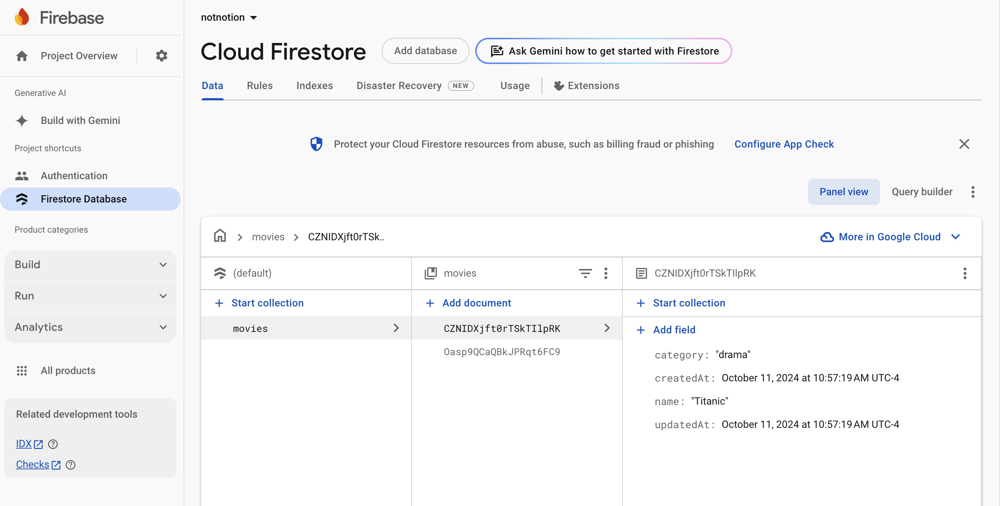
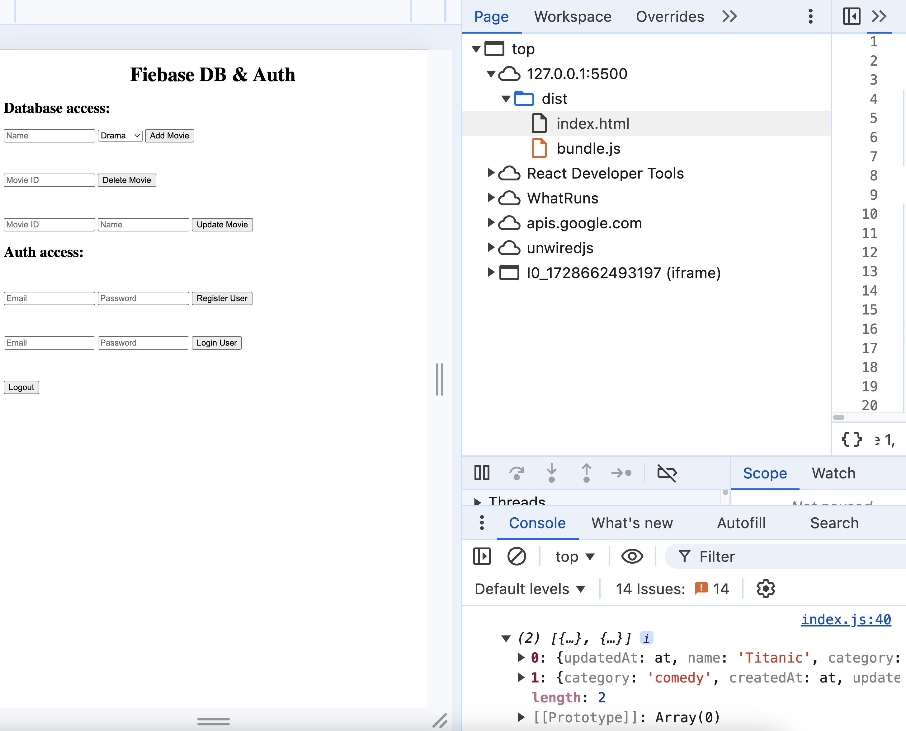
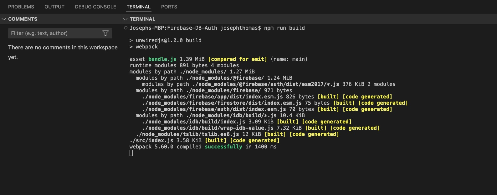

Webpack,Firebase

Data (Movies):

- Fetching Documents
- Add, Delete
- Snapshots
- Firebase Queries
- Ordering Data (Using Indexes)
- Updating Documents
- Fetching Individual Document

Authentication

### Screenshot:

